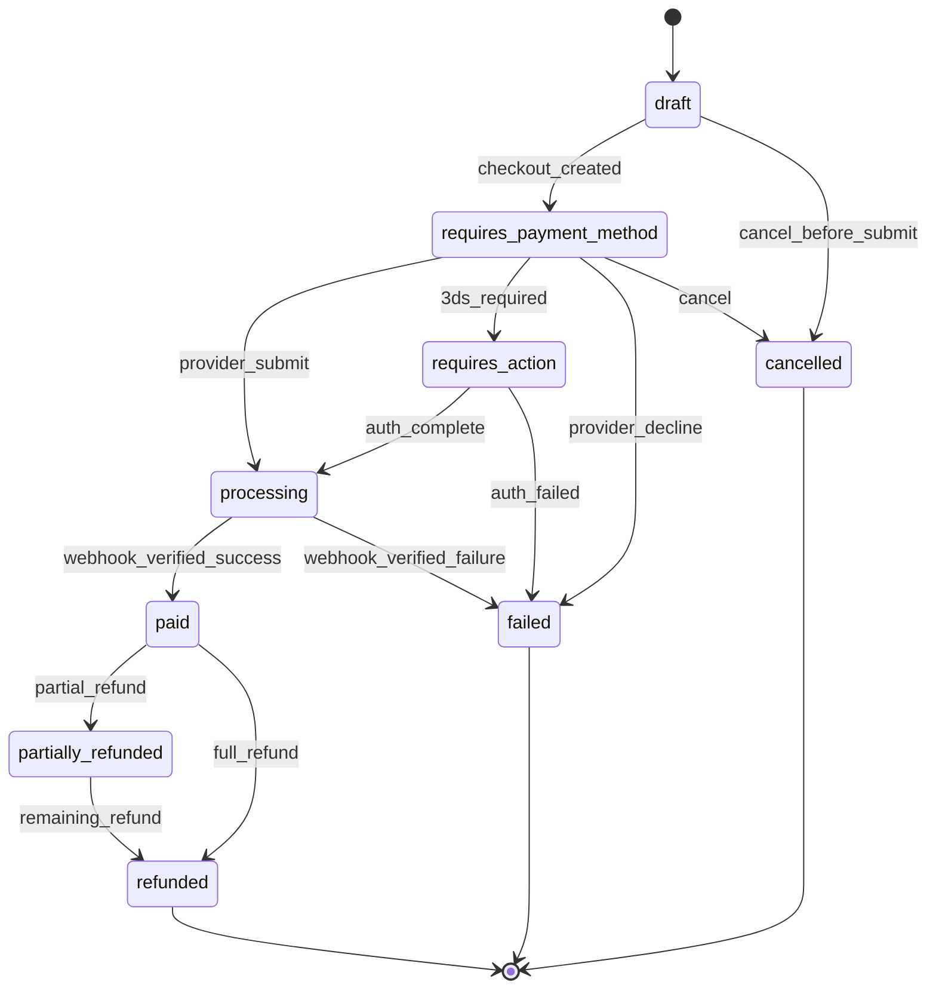
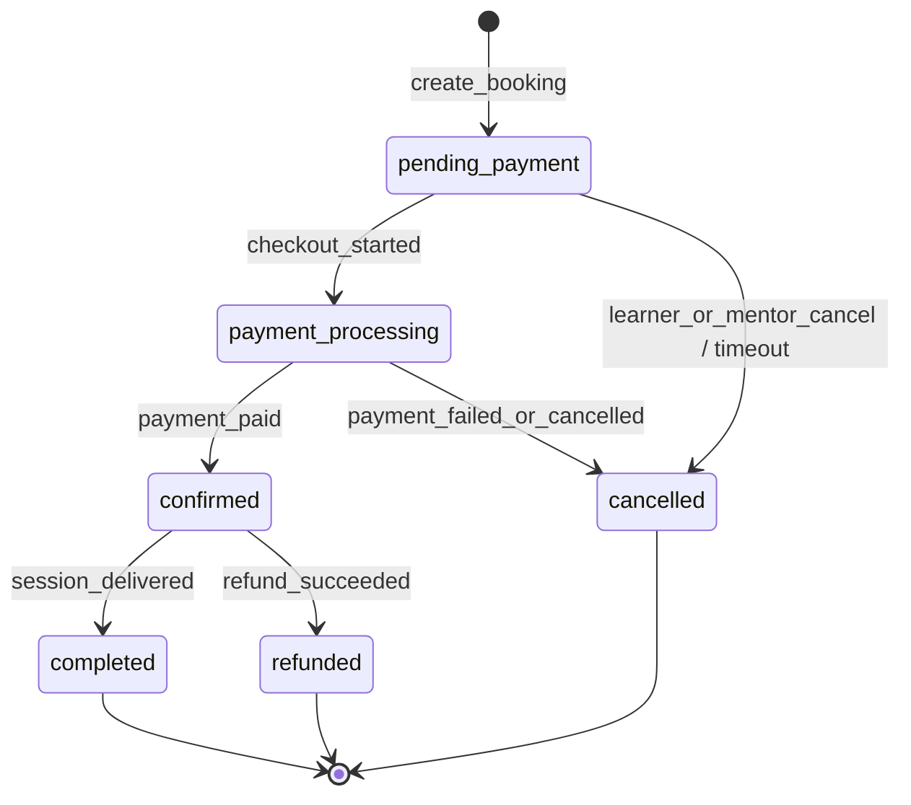
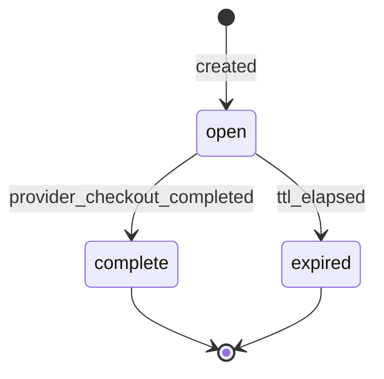
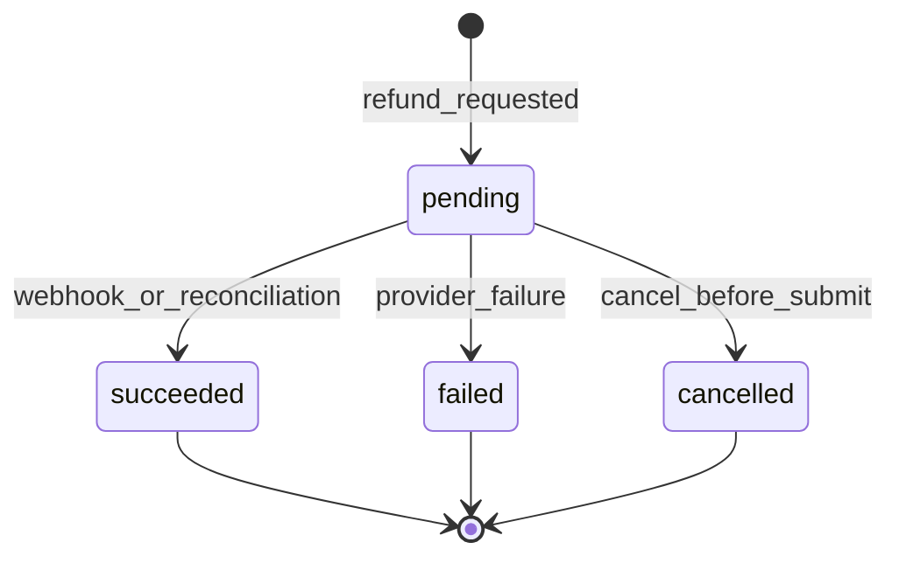

# ApprentorBay Payment Architecture

**Status:** Design only — no payment provider implemented.  
**Scope:** Provider-independent payment layer for USD mentorship commerce.  
**Out of scope:** Brazilian payment logic (e.g. Mercado Pago belongs in a separate `mentorbay.com.br` deployment, not in ApprentorBay core).

This document defines abstractions, state machines, Firestore collections, and API routes **before** implementation. It extends the existing application → relationship flow described in `MENTORSHIP_COMMERCIAL_REQUEST.md` without replacing it.

---

## 1. Design principles

| Principle | Rule |
|-----------|------|
| **Server authority** | Only a verified server-side payment confirmation may mark a payment `paid`. Browser redirects, client callbacks, and optimistic UI are never authoritative. |
| **Provider isolation** | Core mentorship, booking, and payment orchestration contain **no** `if (stripe)` / `if (mercadoPago)` branches. Provider specifics live in adapters only. |
| **Money** | USD only for ApprentorBay. All amounts stored as **integer minor units (cents)**. Reuse `shared/domain/money.ts` conventions (`baseSessionPriceUsd`). |
| **Idempotency** | Every externally visible mutation (checkout creation, webhook handling, refund) is idempotent under retries. |
| **Auditability** | Every payment state transition is recorded in an append-only event log. |
| **Deployment-bound provider** | Provider selection is environment configuration (`PAYMENT_PROVIDER=stripe`), not per-user or per-mentor runtime logic. A future Brazil deployment wires a different adapter at boot. |
| **Relationship compatibility** | Existing `paymentRequired` / `paymentSatisfied` on `mentorshipRelationships` remain the mentorship gate. Payment success sets `paymentSatisfied: true` via the payment service — domain permissions do not change. |

---

## 2. Layered architecture

```
┌─────────────────────────────────────────────────────────────────┐
│  Mentorship domain (shared/domain)                              │
│  Application · Relationship · LearningContract · Permissions    │
│  No provider imports. Uses booking/payment *status* only.       │
└────────────────────────────┬────────────────────────────────────┘
                             │ creates / reads booking status
                             ▼
┌─────────────────────────────────────────────────────────────────┐
│  Booking service (server)                                       │
│  Session purchase unit. Owns booking lifecycle.                 │
└────────────────────────────┬────────────────────────────────────┘
                             │ requests checkout / reads payment status
                             ▼
┌─────────────────────────────────────────────────────────────────┐
│  Payment service (server)                                       │
│  Orchestration: intents, checkout, webhooks, refunds,           │
│  reconciliation, commission splits, payout scheduling.          │
│  Pure domain types in shared/domain/payments.ts                 │
└────────────────────────────┬────────────────────────────────────┘
                             │ calls adapter interface
                             ▼
┌─────────────────────────────────────────────────────────────────┐
│  Provider adapter (server/lib/payments/providers/*)             │
│  StripeAdapter · (future) MercadoPagoAdapter in BR deployment   │
│  Implements PaymentProvider. Maps provider DTOs ↔ domain types.   │
└─────────────────────────────────────────────────────────────────┘
```

**Dependency rule:** arrows point downward only. `shared/domain` never imports server payment adapters.

---

## 3. Core abstractions

Types below are the recommended `shared/domain/payments.ts` contract. They are **interfaces and value objects**, not provider SDK wrappers.

### 3.1 `MoneyAmount`

```typescript
interface MoneyAmount {
  currency: 'USD';           // ApprentorBay: fixed. BR deployment may use 'BRL' in its own fork/config.
  amountCents: number;       // positive integer
}
```

### 3.2 `MarketplaceSplit`

Describes how a captured charge is divided. Persisted on the payment at creation time (immutable snapshot).

```typescript
interface MarketplaceSplit {
  grossAmountCents: number;      // what the learner pays
  platformFeeCents: number;      // ApprentorBay commission
  mentorNetCents: number;        // mentor's share (gross - fee - provider fees if modeled)
  platformFeeBps: number;        // basis points at time of quote (e.g. 1500 = 15.00%)
}
```

`grossAmountCents === platformFeeCents + mentorNetCents` (provider processing fees may be tracked separately in `providerFeeCents` on the payment record).

### 3.3 `PaymentStatus`

Canonical payment lifecycle status. **This is the source of truth** inside ApprentorBay; provider statuses are mapped into it by the adapter.

```typescript
const PAYMENT_STATUS = {
  draft: 'draft',                         // created locally, not yet sent to provider
  requiresPaymentMethod: 'requires_payment_method',
  requiresAction: 'requires_action',      // 3DS / additional auth
  processing: 'processing',               // submitted to provider, awaiting confirmation
  paid: 'paid',                           // funds captured — ONLY via verified webhook or reconciliation
  failed: 'failed',
  cancelled: 'cancelled',                 // voided before capture
  partiallyRefunded: 'partially_refunded',
  refunded: 'refunded',
} as const;
```

Terminal statuses: `paid`, `failed`, `cancelled`, `refunded`.  
`partially_refunded` may transition to `refunded`.

### 3.4 `PaymentIntent`

Represents the platform's intent to collect money for one booking.

```typescript
interface PaymentIntent {
  id: string;                              // Firestore doc id
  bookingId: string;
  relationshipId: string;
  learnerId: string;
  mentorId: string;

  status: PaymentStatus;
  amount: MoneyAmount;
  split: MarketplaceSplit;

  provider: PaymentProviderId;             // e.g. 'stripe' — copied from env at creation
  providerPaymentIntentId: string | null;  // external id after adapter call
  providerCustomerId: string | null;       // optional saved customer

  idempotencyKey: string;                  // client-supplied or server-generated UUID
  latestCheckoutSessionId: string | null;

  failureCode: string | null;
  failureMessage: string | null;

  paidAt: IsoDateString | null;
  cancelledAt: IsoDateString | null;
  createdAt: IsoDateString;
  updatedAt: IsoDateString;
}
```

One active payment intent per booking at a time. Retries create a **new** intent only if the prior intent is `failed` or `cancelled`.

### 3.5 `CheckoutSession`

Short-lived checkout handoff to the provider's hosted or embedded UI.

```typescript
const CHECKOUT_SESSION_STATUS = {
  open: 'open',
  complete: 'complete',       // provider reports checkout finished — NOT authoritative for `paid`
  expired: 'expired',
} as const;

interface CheckoutSession {
  id: string;
  paymentIntentId: string;
  bookingId: string;
  learnerId: string;

  status: CheckoutSessionStatus;
  provider: PaymentProviderId;
  providerCheckoutSessionId: string | null;

  checkoutUrl: string | null;             // redirect URL returned by adapter
  expiresAt: IsoDateString;

  idempotencyKey: string;
  createdAt: IsoDateString;
  updatedAt: IsoDateString;
}
```

`complete` means the learner finished the provider UI. The payment service still waits for a **verified webhook** before setting `PaymentIntent.status = paid`.

### 3.6 `Refund`

```typescript
const REFUND_STATUS = {
  pending: 'pending',
  succeeded: 'succeeded',
  failed: 'failed',
  cancelled: 'cancelled',
} as const;

interface Refund {
  id: string;
  paymentIntentId: string;
  bookingId: string;

  status: RefundStatus;
  amountCents: number;                    // partial refunds allowed
  reason: 'requested_by_learner' | 'booking_cancelled' | 'dispute' | 'admin' | 'other';
  idempotencyKey: string;

  provider: PaymentProviderId;
  providerRefundId: string | null;

  requestedBy: string;                    // uid
  createdAt: IsoDateString;
  updatedAt: IsoDateString;
  succeededAt: IsoDateString | null;
}
```

### 3.7 `MentorPayout` (future-ready)

Payouts are **out of band** from learner checkout but modeled now so commission splits are consistent.

```typescript
const PAYOUT_STATUS = {
  pending: 'pending',           // accrued, not yet sent to provider
  inTransit: 'in_transit',
  paid: 'paid',
  failed: 'failed',
  cancelled: 'cancelled',
} as const;

interface MentorPayout {
  id: string;
  mentorId: string;
  paymentIntentId: string;
  bookingId: string;

  status: PayoutStatus;
  amountCents: number;                    // mentorNetCents from split
  currency: 'USD';

  provider: PaymentProviderId;
  providerPayoutId: string | null;
  providerTransferId: string | null;      // Connect transfer id when applicable

  scheduledAt: IsoDateString | null;
  paidAt: IsoDateString | null;
  createdAt: IsoDateString;
  updatedAt: IsoDateString;
}
```

Initial implementation may create payout records in `pending` without calling a provider payout API.

### 3.8 `PaymentProvider` (adapter interface)

Lives in `server/lib/payments/PaymentProvider.ts` (not in `shared/` — server-only).

```typescript
type PaymentProviderId = 'stripe' | string;  // extensible per deployment

interface PaymentProvider {
  readonly id: PaymentProviderId;

  /** Create or retrieve provider-side payment intent. Must be idempotent on idempotencyKey. */
  createPaymentIntent(input: CreateProviderPaymentIntentInput): Promise<ProviderPaymentIntentResult>;

  /** Create checkout session bound to a provider payment intent. */
  createCheckoutSession(input: CreateProviderCheckoutInput): Promise<ProviderCheckoutResult>;

  /** Verify webhook signature and parse into normalized events. */
  verifyAndParseWebhook(headers: Record<string, string>, rawBody: Buffer): Promise<ProviderWebhookEvent[]>;

  /** Fetch current provider status for reconciliation. */
  getPaymentStatus(providerPaymentIntentId: string): Promise<ProviderPaymentSnapshot>;

  /** Issue refund against a captured payment. */
  createRefund(input: CreateProviderRefundInput): Promise<ProviderRefundResult>;

  /** Optional: initiate mentor transfer/payout. */
  createTransfer?(input: CreateProviderTransferInput): Promise<ProviderTransferResult>;
}
```

Normalized `ProviderWebhookEvent` types:

```typescript
type ProviderWebhookEvent =
  | { type: 'payment_processing'; providerPaymentIntentId: string }
  | { type: 'payment_succeeded'; providerPaymentIntentId: string; paidAt: string; providerChargeId?: string }
  | { type: 'payment_failed'; providerPaymentIntentId: string; failureCode?: string; failureMessage?: string }
  | { type: 'payment_cancelled'; providerPaymentIntentId: string }
  | { type: 'checkout_completed'; providerCheckoutSessionId: string }  // non-authoritative
  | { type: 'refund_succeeded'; providerRefundId: string; amountCents: number }
  | { type: 'refund_failed'; providerRefundId: string; failureCode?: string }
  | { type: 'payout_paid'; providerPayoutId: string };
```

The payment service maps these events to domain state transitions. Adapters never write Firestore directly.

### 3.9 `PaymentEvent` (audit trail)

Append-only log of every transition and webhook receipt.

```typescript
interface PaymentEvent {
  id: string;
  entityType: 'payment_intent' | 'checkout_session' | 'refund' | 'mentor_payout' | 'booking';
  entityId: string;

  eventType: string;            // e.g. 'payment_intent.paid', 'webhook.received', 'reconciliation.adjusted'
  fromStatus: string | null;
  toStatus: string | null;

  actorId: string | null;        // uid or 'system'
  idempotencyKey: string | null;
  providerEventId: string | null;  // dedupe webhooks

  payload: Record<string, unknown>;  // redacted provider snapshot
  createdAt: IsoDateString;
}
```

---

## 4. Booking model

A **booking** is the commercial unit that binds one mentorship session purchase to a payment. It sits between the relationship and the payment service.

### 4.1 `BookingStatus`

```typescript
const BOOKING_STATUS = {
  pendingPayment: 'pending_payment',   // created, awaiting checkout
  paymentProcessing: 'payment_processing',
  confirmed: 'confirmed',               // payment paid — session may proceed
  cancelled: 'cancelled',               // cancelled before or after payment (see payment status)
  completed: 'completed',               // session delivered (future scheduling)
  refunded: 'refunded',
} as const;
```

### 4.2 `MentorshipBooking`

```typescript
interface MentorshipBooking {
  id: string;
  relationshipId: string;
  learnerId: string;
  mentorId: string;

  status: BookingStatus;

  // Commercial snapshot (immutable after creation)
  commercialMode: CommercialMode;
  baseSessionPriceUsd: number;           // cents — copied from relationship/mentor at booking time
  sessionDurationMinutes: number | null;
  split: MarketplaceSplit;

  activePaymentIntentId: string | null;
  confirmedAt: IsoDateString | null;
  cancelledAt: IsoDateString | null;
  cancellationReason: string | null;

  createdAt: IsoDateString;
  updatedAt: IsoDateString;
}
```

**Doc ID convention:** `{relationshipId}_{sequence}` or auto-id with `relationshipId` indexed. For the first paid session per relationship, sequence `1` is sufficient.

### 4.3 Relationship to existing entities

| Existing | Role after payments |
|----------|---------------------|
| `mentorshipApplication` | Unchanged. Still the pairing request. |
| `mentorshipRelationship` | Still the pairing container. `paymentSatisfied` flipped to `true` when the **first** booking for that relationship reaches `confirmed`. |
| `learningContracts` | Still gated by `canStartLearningJourney` → `canAccessPaidMentorshipServices`. No payment logic inside contract machine. |
| `MentorshipBooking` | New. Owns session-level commerce and joinability (future). |

---

## 5. State machines

Define transitions **before** implementation. Invalid transitions throw in the payment service reducer (same pattern as `learningContractMachine.ts`).

### 5.1 End-to-end happy path (paid mentor)

```
Learner has active relationship (paid_request, paymentRequired=true, paymentSatisfied=false)
  → POST /api/bookings  →  booking: pending_payment
  → POST /api/payments/checkout  →  payment: draft → requires_payment_method
                                      checkout: open
  → Learner completes provider UI  →  checkout: complete (non-authoritative)
  → Verified webhook payment_succeeded  →  payment: paid
  → Payment service side effects:
        booking: confirmed
        relationship: paymentSatisfied = true
        mentorPayout: pending (optional record)
  → Learner may start Learning Journey (existing permission gate passes)
  → (future) session becomes joinable when scheduling exists
```

### 5.2 `PaymentStatus` state machine



**Invariant:** `paid` is reachable only from `processing` via `webhook_verified_success` or `reconciliation_adjusted` (admin/system).

### 5.3 `BookingStatus` state machine



### 5.4 `CheckoutSessionStatus` state machine



### 5.5 `RefundStatus` state machine



### 5.6 Cancellation matrix

| Booking status | Payment status | Action | Booking → | Payment → | Refund? |
|----------------|----------------|--------|-----------|-----------|---------|
| `pending_payment` | `draft` / `requires_*` | Learner cancels | `cancelled` | `cancelled` | No |
| `payment_processing` | `processing` | Timeout / abandon | `cancelled` | await webhook | No unless captured |
| `confirmed` | `paid` | Booking cancelled | `refunded` or `cancelled`* | `refunded` / `partially_refunded` | Yes |
| `confirmed` | `paid` | Session completed | `completed` | `paid` | No |

\* Use `refunded` when money returned; `cancelled` only if policy allows credit without refund.

---

## 6. Firestore model

Add to `COLLECTIONS` when implementing (names are stable contracts):

| Collection | Doc ID | Written by | Purpose |
|------------|--------|------------|---------|
| `mentorshipBookings` | auto or `{relationshipId}_{n}` | Server | Booking lifecycle |
| `paymentIntents` | auto | Server | Canonical payment state |
| `checkoutSessions` | auto | Server | Checkout handoff |
| `paymentRefunds` | auto | Server | Refund records |
| `mentorPayouts` | auto | Server | Payout accrual / disbursement |
| `paymentEvents` | auto | Server | Append-only audit trail |
| `paymentWebhookDedup` | `{provider}_{providerEventId}` | Server | Idempotent webhook processing |

**Unchanged collections:** `mentorshipRelationships` gains no payment-provider fields. Only `paymentSatisfied` (already present) is updated by the payment service.

### 6.1 Indexes (add to `firestore.indexes.json`)

```
mentorshipBookings:  relationshipId ASC, createdAt DESC
mentorshipBookings:  learnerId ASC, status ASC, createdAt DESC
mentorshipBookings:  mentorId ASC, status ASC, createdAt DESC
paymentIntents:      bookingId ASC, createdAt DESC
paymentIntents:      learnerId ASC, status ASC, updatedAt DESC
checkoutSessions:    paymentIntentId ASC, createdAt DESC
paymentEvents:       entityType ASC, entityId ASC, createdAt DESC
mentorPayouts:       mentorId ASC, status ASC, createdAt DESC
```

### 6.2 Security rules (sketch)

All payment collections: **deny client writes; deny client reads** except:

- Learners may **read** their own `mentorshipBookings`, `paymentIntents`, and `checkoutSessions` (status + amounts only — no provider secrets).
- Mentors may **read** bookings and payment status for their pairings (not full provider payloads).
- `paymentEvents` and `paymentWebhookDedup`: server only.

### 6.3 Example documents

**`mentorshipBookings/{id}`**

```json
{
  "id": "rel123_1",
  "relationshipId": "learnerUid_mentorUid",
  "learnerId": "learnerUid",
  "mentorId": "mentorUid",
  "status": "pending_payment",
  "commercialMode": "professional",
  "baseSessionPriceUsd": 7500,
  "sessionDurationMinutes": 60,
  "split": {
    "grossAmountCents": 7500,
    "platformFeeCents": 1125,
    "mentorNetCents": 6375,
    "platformFeeBps": 1500
  },
  "activePaymentIntentId": "pi_abc",
  "confirmedAt": null,
  "cancelledAt": null,
  "cancellationReason": null,
  "createdAt": "2026-09-03T18:00:00.000Z",
  "updatedAt": "2026-09-03T18:00:00.000Z"
}
```

**`paymentIntents/{id}`**

```json
{
  "id": "pi_abc",
  "bookingId": "rel123_1",
  "relationshipId": "learnerUid_mentorUid",
  "learnerId": "learnerUid",
  "mentorId": "mentorUid",
  "status": "requires_payment_method",
  "amount": { "currency": "USD", "amountCents": 7500 },
  "split": { "grossAmountCents": 7500, "platformFeeCents": 1125, "mentorNetCents": 6375, "platformFeeBps": 1500 },
  "provider": "stripe",
  "providerPaymentIntentId": "pi_stripe_xyz",
  "providerCustomerId": null,
  "idempotencyKey": "checkout-req-uuid",
  "latestCheckoutSessionId": "cs_abc",
  "failureCode": null,
  "failureMessage": null,
  "paidAt": null,
  "cancelledAt": null,
  "createdAt": "2026-09-03T18:00:01.000Z",
  "updatedAt": "2026-09-03T18:00:01.000Z"
}
```

---

## 7. API routes

All routes are **server-authoritative** (Express + Admin SDK), following existing `/api/*` patterns.

### 7.1 Booking routes — `server/routes/bookings.ts`

| Method | Path | Actor | Description |
|--------|------|-------|-------------|
| `POST` | `/api/bookings` | Learner | Create booking for an active paid relationship. Body: `{ relationshipId }`. Server snapshots price/split. Returns booking. Idempotent on `Idempotency-Key` header. |
| `GET` | `/api/bookings/:id` | Learner / Mentor | Read booking status. |
| `GET` | `/api/relationships/:id/bookings` | Learner / Mentor | List bookings for relationship. |
| `POST` | `/api/bookings/:id/cancel` | Learner / Mentor / Admin | Cancel per policy matrix. Triggers payment cancel or refund flow. |

### 7.2 Payment routes — `server/routes/payments.ts`

| Method | Path | Actor | Description |
|--------|------|-------|-------------|
| `POST` | `/api/payments/checkout` | Learner | Body: `{ bookingId }`. Creates `PaymentIntent` + `CheckoutSession`, calls adapter. Returns `{ checkoutUrl, checkoutSessionId, paymentIntentId }`. Idempotent. |
| `GET` | `/api/payments/intents/:id` | Learner / Mentor | Poll-friendly status read (UI only — not authoritative). |
| `POST` | `/api/payments/intents/:id/cancel` | Learner | Cancel open intent before capture. |

### 7.3 Webhook route — `server/routes/paymentWebhooks.ts`

| Method | Path | Auth | Description |
|--------|------|------|-------------|
| `POST` | `/api/webhooks/payments` | Provider signature | Raw body preserved. Adapter verifies → payment service applies events → writes `paymentEvents` → dedupes by `providerEventId`. **No session cookie auth.** |

### 7.4 Refund routes — `server/routes/refunds.ts` (admin / policy-gated)

| Method | Path | Actor | Description |
|--------|------|-------|-------------|
| `POST` | `/api/refunds` | Admin or system | Body: `{ paymentIntentId, amountCents?, reason }`. |
| `GET` | `/api/refunds/:id` | Admin / parties | Refund status. |

### 7.5 Reconciliation — internal (no public route)

`server/jobs/reconcilePayments.ts` (cron / Cloud Scheduler):

1. Query `paymentIntents` where `status IN ('processing', 'requires_action')` and `updatedAt < now - 15m`.
2. Call `provider.getPaymentStatus`.
3. If provider says succeeded but local is not `paid`, apply `payment_succeeded` through the same reducer as webhooks (with `eventType: reconciliation.adjusted`).
4. Log every adjustment to `paymentEvents`.

---

## 8. Idempotency

| Operation | Key source | Storage |
|-----------|------------|---------|
| Create booking | `Idempotency-Key` header | `mentorshipBookings.idempotencyKey` unique per learner |
| Create checkout | `Idempotency-Key` header | `paymentIntents.idempotencyKey` |
| Webhook processing | `provider` + `providerEventId` | `paymentWebhookDedup/{provider}_{eventId}` |
| Refund | `Idempotency-Key` header | `paymentRefunds.idempotencyKey` |

**Pattern:** Firestore transaction:

1. Check dedup doc / idempotency field.
2. If exists, return stored result.
3. Else write entity + dedup doc atomically.

Provider adapters must pass the same idempotency key to the provider API (e.g. Stripe `Idempotency-Key` header).

---

## 9. Webhook verification

```
HTTP POST /api/webhooks/payments
  → express.raw({ type: 'application/json' })  // mount BEFORE json parser
  → PaymentProviderRegistry.get().verifyAndParseWebhook(headers, rawBody)
  → for each normalized event:
        if paymentWebhookDedup.exists(provider, eventId): skip
        else PaymentService.applyProviderEvent(event) in transaction
        write paymentWebhookDedup
        append paymentEvent
```

Adapters encapsulate signature algorithms (Stripe `Stripe-Signature`, etc.). The payment service never branches on provider-specific header names.

---

## 10. Marketplace commission

Commission is computed **at booking creation** and stored immutably on the booking and payment intent.

```typescript
function computeMarketplaceSplit(grossCents: number, platformFeeBps: number): MarketplaceSplit {
  const platformFeeCents = Math.round((grossCents * platformFeeBps) / 10_000);
  const mentorNetCents = grossCents - platformFeeCents;
  return { grossAmountCents: grossCents, platformFeeCents, mentorNetCents, platformFeeBps };
}
```

`platformFeeBps` comes from server config (`PLATFORM_FEE_BPS`, default TBD). Mentor-facing displays show `mentorNetCents`; learner-facing displays show `grossAmountCents`.

When a provider supports automatic splits (e.g. Stripe Connect), the adapter passes `application_fee_amount` / transfer amounts from the stored split — the domain does not recompute at webhook time.

---

## 11. Mentor payouts (future)

1. On `payment_succeeded`, create `mentorPayouts` doc with `status: pending` and `amountCents = split.mentorNetCents`.
2. Batch job or admin action calls `provider.createTransfer` when mentor onboarding is complete.
3. Webhook `payout_paid` moves payout to `paid`.

Payout failures do **not** roll back booking confirmation — they are operational issues surfaced in admin tooling.

---

## 12. Provider registry (deployment wiring)

```typescript
// server/lib/payments/registry.ts — NOT imported by shared/domain
function createPaymentProvider(): PaymentProvider {
  const id = process.env.PAYMENT_PROVIDER;
  switch (id) {
    case 'stripe':
      return new StripePaymentProvider(/* env vars */);
  default:
    throw new Error(`Unsupported PAYMENT_PROVIDER: ${id}`);
  }
}
```

**ApprentorBay (international):** `PAYMENT_PROVIDER=stripe` (or similar US/international provider).  
**mentorbay.com.br (future separate deployment):** `PAYMENT_PROVIDER=mercado_pago` with a `MercadoPagoPaymentProvider` adapter in that deployment's codebase or a shared `providers/` package — **not** imported into ApprentorBay's default server bundle.

---

## 13. Payment service reducer

Mirror `learningContractMachine.ts`:

```typescript
// shared/domain/paymentMachine.ts (pure functions + tests)
function reducePaymentIntent(
  intent: PaymentIntent,
  action: PaymentIntentAction,
  now: IsoDateString,
): PaymentIntent;

function reduceBooking(
  booking: MentorshipBooking,
  action: BookingAction,
  now: IsoDateString,
): MentorshipBooking;
```

`PaymentService` (server) orchestrates:

1. Load entities.
2. Call `reduce*` inside a Firestore transaction.
3. Persist.
4. Append `paymentEvents`.
5. Emit side effects (update `relationship.paymentSatisfied`, enqueue payout).

---

## 14. Permissions integration

Add to `shared/domain/permissions.ts` (no provider logic):

```typescript
canCreateBooking(actor, relationship)      // learner, active, paid_request, no open booking
canStartCheckout(actor, booking)           // learner, booking.pending_payment
canCancelBooking(actor, booking)           // learner or mentor per policy
canReadBooking(actor, booking)             // pairing member or admin
```

Existing gates unchanged:

- `canStartLearningJourney` → still uses `canAccessPaidMentorshipServices(relationship)`.
- Payment service sets `paymentSatisfied: true` when booking reaches `confirmed`.

---

## 15. Failure handling

| Scenario | Behavior |
|----------|----------|
| Card declined | Webhook / sync → `payment.failed` → booking `cancelled` or stays `pending_payment` (allow retry with new checkout) |
| 3DS abandoned | Checkout `expired`; payment `cancelled` after TTL |
| Duplicate webhook | Dedup doc prevents double-apply |
| Webhook delay | UI polls `GET /api/payments/intents/:id`; reconciliation job backstops |
| Partial capture N/A | ApprentorBay uses full capture only in v1 |
| Refund after confirm | Booking → `refunded`; relationship `paymentSatisfied` policy: remain `true` if service was delivered; admin may reset |

---

## 16. Implementation phases (recommended)

| Phase | Deliverable |
|-------|-------------|
| **1 — Domain** | `shared/domain/payments.ts`, statuses, `paymentMachine.ts`, permissions, tests |
| **2 — Persistence** | Collections, indexes, rules, `PaymentService` skeleton |
| **3 — Booking API** | Create/cancel booking without provider (dry-run / `provider=mock`) |
| **4 — Provider** | First `PaymentProvider` adapter + checkout + webhooks |
| **5 — Reconciliation** | Cron job + admin visibility |
| **6 — Refunds & payouts** | Refund API + mentor payout records |

**This task stops at Phase 0:** architecture and model definition only.

---

## 17. What not to do

- Do not set `paymentSatisfied` from client routes or Firestore client SDK writes.
- Do not branch on provider name in `shared/domain` or mentorship routes.
- Do not store floats for money.
- Do not treat `checkout.complete` or browser `?success=true` as payment confirmation.
- Do not embed Mercado Pago / PIX / BRL types in ApprentorBay's shared domain.

---

## 18. Glossary

| Term | Meaning |
|------|---------|
| **Booking** | One purchasable mentorship session tied to a relationship |
| **Payment intent** | Platform record tracking collection of funds for a booking |
| **Checkout session** | Provider-hosted payment UI session |
| **Adapter** | Provider-specific implementation of `PaymentProvider` |
| **Reconciliation** | Server job aligning local status with provider truth |
